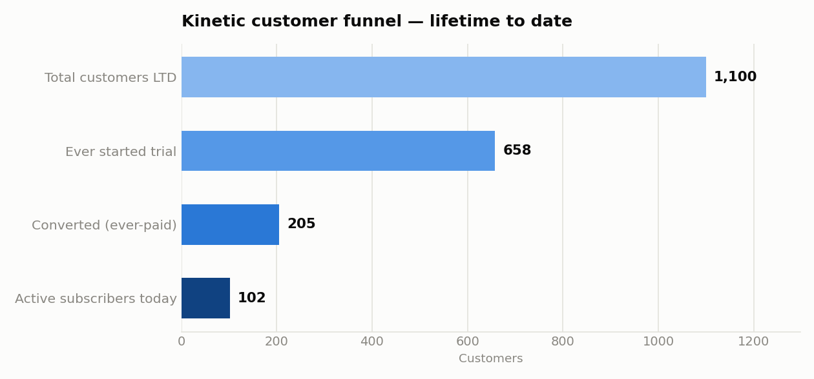
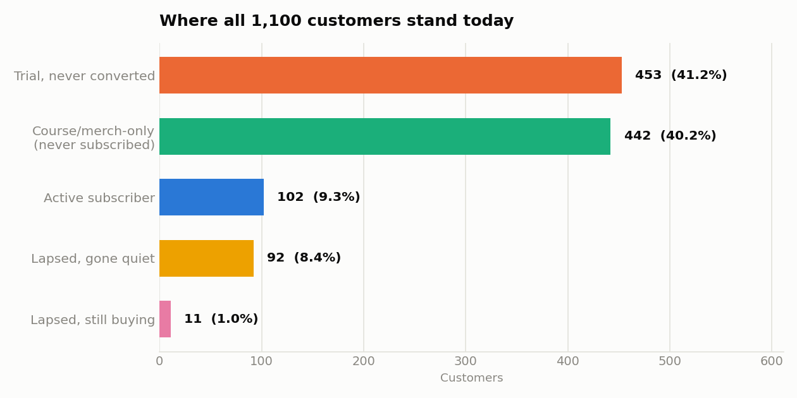

# Phase 0 Simulation — Summary Analysis

**Run date:** 2026-07-30 | **Scale:** 1,100 customers, 21,800 anonymous visitors, Aug 2023 – Jul 2026

This analysis covers the recalibrated Phase 0 simulation: 100 active subscribers today,
a 30% trial-to-paid conversion rate, and a 40%-annual-retention / 3-month-average-churner
churn model, as approved.

## 1. The customer funnel

| Stage | Count | % of previous stage |
|---|---|---|
| Total customers LTD | 1,100 | — |
| Ever started a trial | 658 | 59.8% |
| Converted to paying (ever-paid) | 205 | 31.2% |
| **Active subscribers today** | **102** | 49.8% of ever-paid |

Every customer who isn't a trial-starter (442 people, 40.2% of the base) created an
account for a course or merch purchase and never touched the subscription funnel at
all — consistent with the 60/40 ever-subscribe split.

## 2. Where everyone stands today

| Segment | Count | % of total |
|---|---|---|
| Trial, never converted | 453 | 41.2% |
| Course/merch-only (never subscribed) | 442 | 40.2% |
| Active subscriber | 102 | 9.3% |
| Lapsed, gone quiet since lapsing | 92 | 8.4% |
| Lapsed, still buying since lapsing | 11 | 1.0% |
| **Total** | **1,100** | **100%** |

The two largest groups — trial-non-converters and course/merch-only accounts — are
both "touched Kinetic, never became a recurring subscriber" outcomes, together nearly
82% of everyone who's ever created an account. That's an intentional, realistic
consequence of the 30% trial conversion rate: most people who try Kinetic don't stick.

## 3. Churn model — how the two targets were both hit

A single constant monthly churn rate can't simultaneously produce "40% annual
retention" and "3-month average tenure for churners" — under a constant hazard, those
two numbers are mechanically the same rate expressed two ways. Instead, every
converting subscriber is assigned to one of two segments at conversion:

| Segment | Share of converts (target / realized) | Behavior |
|---|---|---|
| Quick churn | 61.1% / 59.0% (121 of 205) | Tenure drawn from an exponential distribution averaging 3 months; nearly all churn within the first year |
| Loyal | 38.9% / 41.0% (84 of 205) | Does not organically churn within the 3-year window (may still show a resolved payment-failure blip, but no cancellation) |

**Realized average tenure among everyone who actually churned: 2.68 months** (target: 3.0) —
close, and expected to vary by seed given the exponential distribution's natural spread.
Because virtually all realized churns come from the quick segment, this average stayed
near 3 months rather than drifting toward the loyal segment's much longer (effectively
open-ended) tenure.

Of the 103 lapsed subscribers, a small slice keep transacting after lapsing:

| Post-lapse behavior | Target | Realized |
|---|---|---|
| Still buying courses/merch since lapsing | 10% | 10.7% (11 of 103) |
| Gone completely quiet | 90% | 89.3% (92 of 103) |

## 4. Trial funnel detail

| Outcome | Target | Realized (of 658 trial starters) |
|---|---|---|
| Converted | 30% | 31.2% (205) |
| Canceled during trial | 15% | 15.0% (99) |
| Expired passively | 55% | 53.8% (354) |

All three land within normal sampling variance of target.

## 5. Reactivations (win-backs)

29 customers have at least one reactivation event in their history — a churned
subscriber who later resubscribed. Reactivation channel is tagged per the existing
weights (50% email, 15% push, 35% organic self-return), which becomes the answer key
for validating attribution once the Braze tables exist in Phase 6.

## 6. Order volume

3,086 total orders across the 1,100 customers (1,398 course, 1,688 merch), plus 1,597
guest merch orders from the 21,800-person anonymous population (7.3% guest-conversion
rate, matching the target). Total commerce volume across the dataset: **4,683 orders**
over 3 years.

## 7. Scale changes from the original plan

| Parameter | Original | Now | Why |
|---|---|---|---|
| Total customers | 100 | 1,100 | Needed to sustain 100 *active* subscribers under a much churnier retention model |
| Anonymous population | 2,000 | 21,800 | Scaled proportionally to keep the guest-conversion ratio realistic |
| Trial conversion rate | 65% | 30% | Judged too high; lowered per your instruction |
| Churn model | Single 11-month mean tenure | Two-segment (61% quick/3mo, 39% loyal) | The only way to hit both "40% annual retention" and "3-month average churner tenure" at once |

## 8. What this means for later phases

- The `subscriptions` table (Phase 2) will materialize these intervals directly —
  102 currently-`active` rows, 103 `canceled` rows (some with a subsequent `resumed`
  interval from the 29 reactivations).
- The `orders` table (Phase 3) needs to respect that lapsed-and-quiet customers
  (92 of them) contribute zero rows after their churn date — already enforced in the
  order-generation logic, not just a post-hoc filter.
- `customer_segment_membership` (Phase 4) has a clean source: the "Active subscriber,"
  "Lapsed," and "Course/merch-only" groups above map directly to real segments,
  computed from this same ground truth rather than invented separately.
